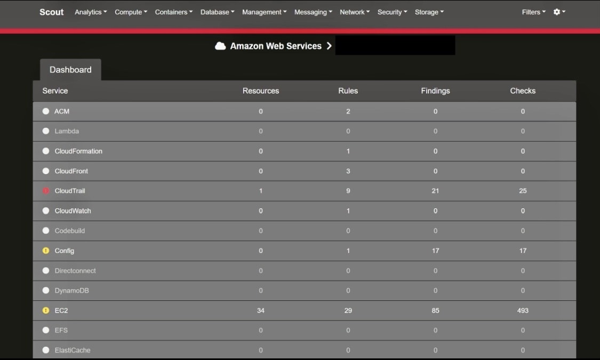
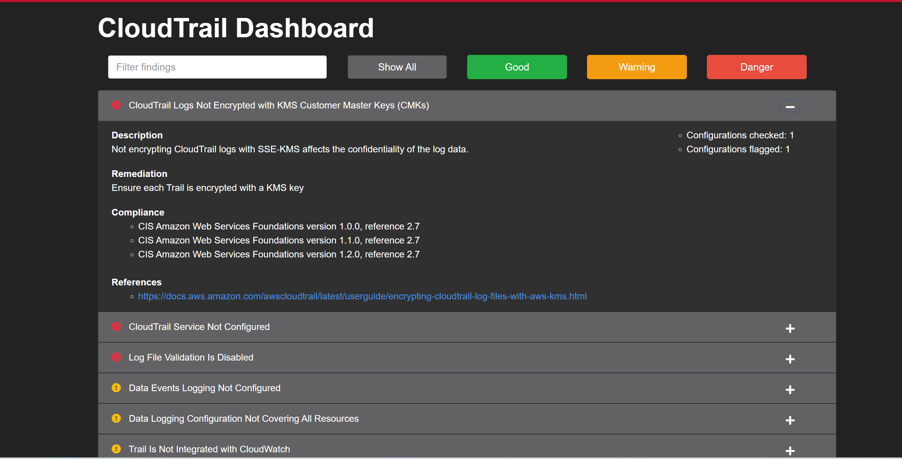

# SECURITY PROJECT - MINI SECOPS

- An end-to-end **cloud security mini project** using Terraform, Docker, ScoutSuite, & GitHub Actions

## Overview

- This project provisions a secure AWS environment with **Terraform**, runs a **ScoutSuite** audit inside a Docker container, and automates scans using **GitHub Actions**.  

This projects demonstrates:
        - IaC for AWS security (S3 log bucket, CloudTrail, GuardDuty)
        - Security auditing with ScoutSuite
        - CI/CD automation to generate audit reports on every push

## Tech Stack

- **Terraform** — Infrastructure as Code  
- **AWS** — CloudTrail, GuardDuty, S3  
- **Docker** — Containerized ScoutSuite  
- **ScoutSuite** — Multi-cloud security auditing tool  
- **GitHub Actions** — CI/CD automation for cloud scans

## 📸 Screenshots

### ScoutSuite Dashboard
This shows the **overall security posture** of the AWS account, with findings categorized by severity.

### Example Danger Finding (CloudTrail)
This example highlights a **Danger-level issue** where CloudTrail was not configured securely, with remediation advice.

## Findings

ScoutSuite identified issues such as:
- S3 bucket versioning disabled
- CloudTrail not multi-region
- Root account access used
